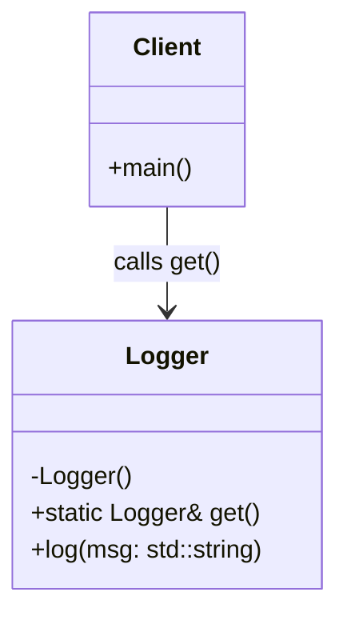

# Singleton Pattern

**Definition:** the Singleton pattern guarantees a class has exactly one instance and gives global access to it. The class controls its own single object: the constructor is private, and one static method hands out the same instance every time.

**When to use it:** when exactly one object must coordinate access to a shared resource, and having two would be wrong or unsafe. In embedded work the natural fits are a hardware peripheral that physically exists once (one UART, one system clock, one flash controller), a device configuration store, or a logger that all modules write to. If a second instance would mean two objects fighting over one piece of hardware, that's the signal for a Singleton.

**When not to use it:** when you reach for it just to avoid passing an object around. A Singleton is global state, which makes unit testing harder (you can't easily swap it for a mock) and hides dependencies. On multicore or RTOS targets you also have to think about thread safety and initialization order. Prefer passing the object explicitly unless single-instance is a real hardware or system constraint.

## Compile the code
```
g++ -std=c++17 singleton/main.cpp -o singleton/logger_demo
./singleton/logger_demo
```

## UML


